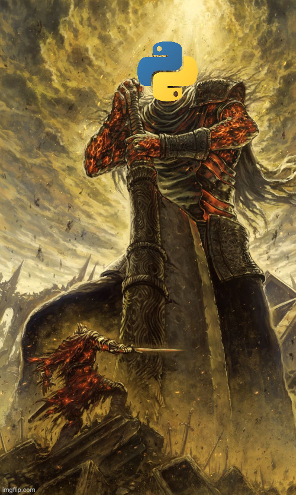

# Hangman

**TIPS**: Dette er en **Markdown**-fil!

Du kan få en bedre visning ved å trykke på **preview**-knappen oppe til høyre i VSCODE (den har et forstørrelsesglass).



---

# Oppgavebeskrivelse

I dette prosjektet skal du lage programmet "Hangman".

Oppgaven er delt inn i 4 deler, med økende vanskelighetsgrad.
Husk at du har begrenset tid, og at du må selv velge hvor mye innsats du ønsker å legge inn i prosjektet. Det viktigste er å **se muligheten for egen læring og forståelse for faget**!

---

### Det er fullt mulig å få god karakter uten å bli ferdige med alle delene!

Se [vurderingskriteriene](#vurderingskriterier) på bunnen av siden.

Noen viktige punkter som dere må huske i forhold til vurdering:

- Dere må pushe til GitHub repoet **minimum** èn gang hver dag dere jobber med prosjektet.
- Husk å kommentere godt
- Eventuelle kilder legger du til i [kilder.md](/kilder.md)
- Vær forberedt på å forklare koden til lærer etter innlevering.
- Les vurderingskriterene godt!

## Del 1

Ting som må gjøres er:

- Spillet skal bruke en `main funksjon`, som kjører når applikasjonen startes
  - Sjekk ut [main.md](/main.md) for eksempelbruk
- Spør først brukeren om et hemmelig ord
- Spør så hvor mange liv/forsøk brukeren skal ha
- Hent inn en bokstav fra brukeren
  - _Tips: Start med en while-løkke!_
- Sjekk om denne er i det hemmelige ordet
  - Trekk fra et liv dersom brukeren tipper feil
- Hvis brukeren ikke har flere liv skal løkken avsluttes
  - _Tips: bruk "break" for å avslutte en løkke_
- Brukeren skal alltid få vite hvor mange liv hen har igjen
- Ugyldige inntastinger fra bruker skal ikke kræsje spillet, men gi fornuftige tilbakemeldinger om feilen

PS: Husk å skrive ut resultatet til brukeren.

Eksempel på kjøring av kode:

```python
Skriv inn det hemmelige ordet: hemmelig
Hvor mange forsøk får brukeren? 2
Gjett på én bokstav i ordet: f
Bokstaven f er ikke i ordet.
Du har 1 liv igjen, prøv på nytt.
Gjett på én bokstav i ordet: h
Stemmer, bokstaven er i ordet
Gjett på én bokstav i ordet: e
Stemmer, bokstaven er i ordet
Gjett på én bokstav i ordet: r
Bokstaven r er ikke i ordet.
Du har ingen liv igjen.
```

## Del 2

Ting som må gjøres er:

- Brukeren skal få feedback på hvilke bokstaver hen har klart og mangler:
  - `lø*n*ng`
- Når brukeren starter spillet skal hen måtte velge vanskelighetsnivå. Vanskeligere nivå gir kortere ord
  - Vanskelighetsnivået er basert på hvor langt ordet brukeren taster inn er
    - <= 3 bokstaver = hardmode
    - <= 5 bokstaver = vanskelig
    - <= 7 bokstaver = normal
    - <= 9 bokstaver = lett
    - \> 9 bokstaver = superlett
  - Highscore er en tallverdi som skal vises når brukeren har fullført et spill
    - Brukeren skal da også få muligheten til å taste inn et navn som lagres med highscoren sin
  - Highscore er basert på hvor mange liv brukeren har igjen og lengden av ordet
  - Brukeren skal kunne lagre sin highscore med navn, og når spillet lastes inn skal highscore-listen vises til brukeren

## Del 3

Vedlagt er 369 652 mulige engelske ord som kan brukes i hangman-spillet.

Ting som må gjøres er:

- Endre koden slik at brukeren må velge vanskelighetsgrad når spillet starter
  - Du kan bruke vanskelighetsgradene i [Del 2](#del-2)
  - Basert på vanskelighetsgrad skal et tilfeldig ord med riktig lengde fra ordlisten lastes inn

## Del 4

For å gjøre det vanskeligere for brukerne å bruke tekstfilen som fasit, er det ønskelig at applikasjonen bruker den krypterte ordlisten i stedet for klartekst. Denne tekstfilen inneholder de samme ordene kryptert med såkalt "Caesar Cipher".

Caesar Cipher er en gammel krypteringsalgoritme som forskyver alle bokstavene i ordet med et antall plasser i alfabetet. Går forskyvningen forbi den siste bokstaven i alfabetet, "wrapper" den rundt og starter på `a` igjen (eller motsatt hvis man går bakover).

Du kan lese mer om Caesar Cipher [her](https://no.wikipedia.org/wiki/C%C3%A6sarchiffer) og [her](https://cryptii.com/pipes/caesar-cipher).

Eksempel:

- `abc` med Caesar Cipher = 3 blir `def`
- `programmering` med Caesar Cipher = 1 blir `qsphsbnnfsjoh`
- `xyz` med Caesar Cipher = 3 blir `abc` (merk at den "wrapper" rundt i alfabetet)
- `jon` med Caesar Cipher = 12 blir `vaz`

Ting som må gjøres:

- Når en bruker starter et spill, skal applikasjonen laste inn et tilfeldig ord fra den krypterte ordlisten og dekode ordet for bruk av spillet
  - Antallet forskyvninger gjort for hvert ord er definert av lengden på ordet
    - Eksempel: `ddd` er 3 bokstaver langt, altså er det originale ordet `aaa`
    - Eksempel 2: `gssp` er 4 bokstaver langt, altså er det originale ordet `cool`
    - Eksempel 3: `fuuqj` er 5 bokstaver langt, altså er det originale ordet `apple`
  - Du kan anta alle ord har småbokstaver og at hvert ord er på en egen linje
  - _Tips: `\n`-operatoren (linjeskift) kan være nyttig_

## Del ∞

I denne delen kan du prøve deg på å endre applikasjonen til å benytte et grafisk brukergrensesnitt.
Her kan du godt bruke python biblioteker slik som [tkinter](https://realpython.com/python-gui-tkinter/).

## Innlevering

Når du har pushet til repoet på GitHub er oppgaven levert.

# Vurderingskriterier

|                   | Lav                                                                                                                                                | Middels                                                                                                                                                        | Høy                                                                                                                                                                                                                                 |
| :---------------: | :------------------------------------------------------------------------------------------------------------------------------------------------- | :------------------------------------------------------------------------------------------------------------------------------------------------------------- | :---------------------------------------------------------------------------------------------------------------------------------------------------------------------------------------------------------------------------------- |
|    Applikasjon    | Du har skrevet et kjørbart Python-program                                                                                                          | Du har utformet et kjørbart Python-program med en overordnet main-funksjon                                                                                     | Du har utformet et kjørbart Python-program med en overordnet main-funksjon. Programmet har tydelige funksjonaliteter og et godt brukergrensesnitt                                                                                   |
|       Kode        | Du har brukt noen Python funksjonaliteter for å løse problemene. Noen problemer er hardkodet\*                                                     | Du har brukt mange varierte Python funksjonaliteter og løser problemene med god kode                                                                           | Koden du har skrevet løser problemene effektivt og godt med varierte Python funksjonaliteter. Koden din gjentar seg ikke (DRY\*\*), og følger Python sine konvensjoner.                                                             |
|   Dokumentasjon   | Du har tydelige navn på funksjoner                                                                                                                 | Du har skrevet noen kommentarer og har tydelige navn på funksjoner                                                                                             | Du har skrevet godt forklarende kommentarer som forklarer funksjonaliteten til funksjoner der det er utydelig hva som blir gjennomført                                                                                              |
|    Feilsøking     | Du har noen bugs i koden                                                                                                                           | Du har noen bugs i koden, men som ikke går ut over applikasjonen sin øvrige funksjonalitet                                                                     | Koden er feilfri                                                                                                                                                                                                                    |
| Unntakshåndtering | Du har tatt litt hensyn til merkelig brukerinput i koden din                                                                                       | Du har tatt noe hensyn til merkelig brukerinput i koden din og mulige unntak/feilmeldinger. Bruker får tilbakemelding når det oppstår en feil.                 | Du har tatt hensyn til all mulig brukerinput og unntak/feilmeldinger. Ved feil får brukeren informativ tilbakemelding basert feilen                                                                                                 |
|        Git        | Du har skrevet koden selv, og pushet kode til repoet på GitHub hver dag du har jobbet med prosjektet\*\*\*. Har du brukt kilder, er disse vedlagt. | Du har skrevet koden selv, og pushet kode til repoet på GitHub flere ganger i hver økt/dag\*\*\*. Har du brukt kilder, er disse vedlagt med lenke og lesedato. | Du har skrevet koden selv, og pushet kode til repoet på GitHub flere ganger i hver økt/dag, med hensiktsmessige commit-meldinger som forklarer hva som er gjort\*\*\*. Du har lagt ved alle relevante kilder med lenke og lesedato. |

### _\* Hardkoding er når man skriver statisk kode som ikke tar hensyn til dynamiske endringer/input_

### _\*\* DRY: Don't repeat yourself. Ikke skriv samme koden flere ganger_

### _\*\*\* Blir det tid skal koden forklares til en lærer_

# Credit:

- English-words repository: [dwyl på GitHub](https://github.com/dwyl/english-words)
